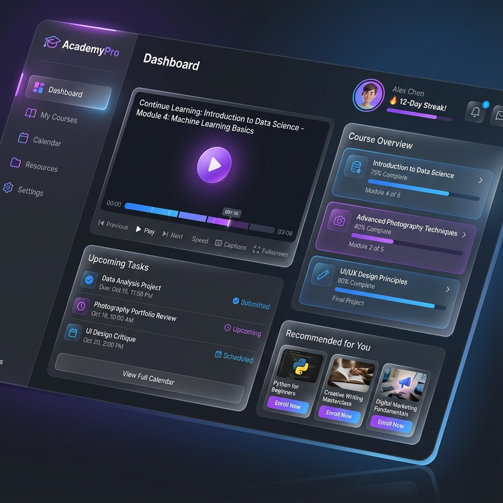

# Portfolio Website 🚀

A modern, responsive personal portfolio website built with vanilla HTML, CSS, and JavaScript. Featuring a dark-themed glassmorphism aesthetic with neon accents to showcase projects, skills, and experience.



## 🌐 Live Demo
**[View Live Portfolio](https://Preethesh26.github.io/Portfolio-)**

## ✨ Features
- **Modern UI/UX:** Dark theme with glassmorphism effects and neon glowing gradients.
- **Responsive Design:** Fully optimized for desktops, tablets, and mobile devices.
- **Interactive Elements:** Cursor glow effects, scroll animations, and typing effects.
- **Project Showcase:** Detailed cards for featured projects with zoom effects and custom visuals.
- **Timeline:** Vertical timeline for professional experience.
- **Contact Form:** Integrated contact section (UI only).

## 🛠️ Tech Stack
- **Frontend:** HTML5, CSS3 (Custom Properties, Flexbox/Grid), JavaScript (ES6+)
- **Icons:** Font Awesome 6
- **Fonts:** 'Outfit' and 'Space Grotesk' (Google Fonts)

## 🚀 Getting Started

### Prerequisites
You just need a modern web browser to view the site. To make edits, you'll need a code editor like VS Code.

### Installation
1. **Clone the repository:**
   ```bash
   git clone https://github.com/Preethesh26/Portfolio-.git
   cd Portfolio-
   ```

2. **Run locally:**
   You can open `index.html` directly in your browser, or use a simple local server for better performance:
   ```bash
   # If you have Python installed:
   python3 -m http.server 8000
   ```
   Then visit `http://localhost:8000`

## 📂 Project Structure
```
Portfolio-/
├── assets/          # Project images and resource files
├── index.html       # Main HTML structure
├── style.css        # Global styles, variables, and animations
├── script.js        # UI logic, animations, and mobile menu
└── README.md        # Project documentation
```

## 📬 Contact
**Preethesh**  
- 📧 Email: [kulalpreethesh20@gmail.com](mailto:kulalpreethesh20@gmail.com)
- 💼 LinkedIn: [Preethesh](https://linkedin.com/in/preethesh26)
- 🐙 GitHub: [@Preethesh26](https://github.com/Preethesh26)

---
© 2025 Preethesh. All Rights Reserved.
